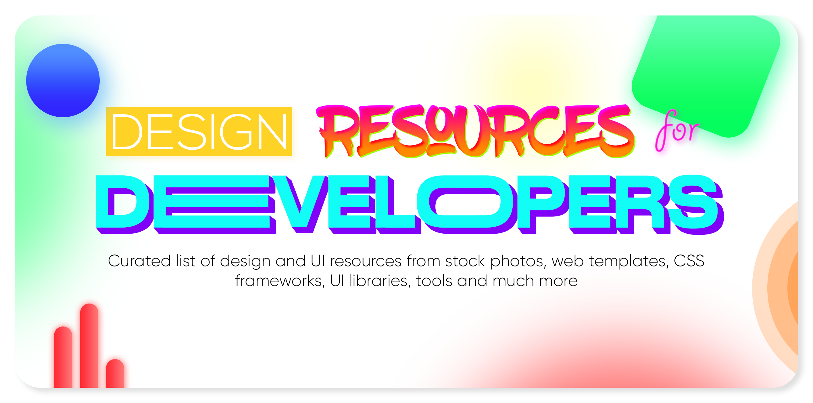

#### Please read [`contributing guidelines`](./contributing.md) before submitting new resources.

## Table of Contents

- [UI Graphics](#ui-graphics)
- [Fonts](#fonts)
- [Colors](#colors)
- [Icons](#icons)
- [Favicons](#favicons)
- [Icon Fonts](#icon-fonts)
- [Stock Photos](#stock-photos)
- [Stock Videos](#stock-videos)
- [Stock Music & Sound Effects](#stock-music--sound-effects)
- [Vectors & Clipart](#vectors--clip-art)
- [Product & Image Mockups](#product--image-mockups)
- [HTML & CSS Templates](#html--css-templates)
- [CSS Frameworks](#css-frameworks)
- [CSS Animations](#css-Animations)
- [Javascript Animations](#javascript-animation-libraries)
- [UI Components & Kits](#ui-components--kits)
- [React UI Libraries](#react-ui)
- [Vue UI Libraries](#vue-ui)
- [Angular UI Libraries](#angular-ui)
- [Svelte UI Libraries](#svelte-ui)
- [Design Systems & Style Guides](#design-systems--style-guides)
- [Online Design Tools](#online-design-tools)
- [Downloadable Design Software](#downloadable-design-software)
- [Design Inspiration](#Design-inspiration)
- [Image Compression](#Image-compression)
- [Chrome Extensions](#Chrome-extensions)
- [Others](#others)

## UI Graphics

>Websites and resources with modern UI components in different formats such as PSD, Sketch, Figma, etc. They are great for ideas for web components/UI

| Website&nbsp; &nbsp; &nbsp; &nbsp; &nbsp; &nbsp; &nbsp; &nbsp; &nbsp; &nbsp; &nbsp; &nbsp; &nbsp; &nbsp; | Description                                                        |
| -------------------------------------------------------------------------------------------------------- | ------------------------------------------------------------------ |
| [UI Design Daily](https://uidesigndaily.com/)                                                            | Awesome UI Components of all types                                 |
| [100 Daily UI](https://100dailyui.webflow.io/)                                                           | Free Figma library of products, elements, and screens              |
| [Sketch App Sources](https://www.sketchappsources.com/)                                                  | Sketch UIs, wireframes, icons and much more                        |
| [Humaaans](https://www.humaaans.com/)                                                                    | Cool illustrations of people with the ability to mix and match     |
| [Paaatterns](https://products.ls.graphics/paaatterns/)                                                   | Free collection of beautiful patterns for all vector formats       |
| [thepatternlibrary](http://thepatternlibrary.com/)                                                       | Free beautiful background patterns                     |
| [404 illustration](https://error404.fun/)                                                                | free illustrations for 404  pages |
| [Drawkit.io](https://www.drawkit.io/)                                                                    | Illustrations for designers and startups                           |
| [Undraw.co](https://undraw.co/)                                                                          | Open-source illustrations for any idea you can imagine and create  |
| [Manypixels.co](https://www.manypixels.co/gallery/)                                                      | Monochromatic, Isometric high quality illustrations                |
| [Open Peeps](https://www.openpeeps.com/)                                                                 | Hand drawn illustration library                                    |
| [UI Space](https://uispace.net/)                                                                         | Thousands of great UI freebies                                     |
| [Animations.co](http://animaticons.co/)                                                                  | Beautiful, customizable animated GIF icons                         |
| [Uplabs](https://www.uplabs.com/)                                                                        | High-quality design resources (Free & Premium)                     |
| [InvisionApp](https://www.invisionapp.com/inside-design/design-resources/)                               | Library of free, high-quality UI kits, icon packs, and mockups     |
| [Open Doodles](https://www.opendoodles.com/)                                                             | A Free Set of Sketchy Illustrations                                |
| [Avataaars](https://avataaars.com/)                                                                      | Free sketch library of avatars illustrations by Pablo Stanley      |
| [FreebieSketch](http://freebiesketch.com/)                                                              | Free Sketch designs, wireframes, illustrations, and more.          |
| [Blush](https://blush.design/)                                                                           | Free customizable illustrations with Figma Plugin                  |
| [Hero Patterns](http://www.heropatterns.com/)                                                            | A collection of repeatable SVG background patterns         |
| [IRA Design](https://iradesign.io/)                                                                     | An open-source gradient illustrations collection by creative tim.  |
| [Storytale.io](https://storytale.io/freebies/) | Subset of Storytale free quality illustrations |
| [icons8.com/illustrations](https://icons8.com/illustrations) | Free vector illustrations to class up your project |
| [Patternico](https://patternico.com) | Seamless Pattern Maker |
| [Freellustrations](https://freellustrations.com/) | Free Background Images for awesome landing Pages |
| [Pixeltrue Illustrations](https://www.pixeltrue.com/illustrations) | Free Animated Illustrations |

    <b><a href="#table-of-contents">↥ Back To Top</a></b>

## Fonts

>Websites that offer free fonts as well as font based tools

| Website&nbsp; &nbsp; &nbsp; &nbsp; &nbsp; &nbsp; &nbsp; &nbsp; &nbsp; &nbsp; &nbsp; &nbsp; &nbsp; &nbsp; | Description |
| ----------------------- | ------------------ |
| [Google Fonts](https://fonts.google.com/)| Library of around 1000 free licensed font families |
| [DaFont](https://www.dafont.com/)| Archive of freely downloadable fonts |
| [Use & Modify](https://usemodify.com/)| Personal selection of beautiful, classy, punk, professional, incomplete, weird typefaces |
| [1001 Free Fonts](https://www.1001freefonts.com/)| I think the name speaks for itself :smirk: |
| [Font Squirrel](https://www.fontsquirrel.com/)| Font Squirrel scours the internet for high quality, legitimately free fonts |
| [Font Fabric](https://www.fontfabric.com/free-fonts/)| A digital type foundry crafting retail fonts and custom typography for various brands |
| [Tiff](https://tiff.herokuapp.com/)| A type diff tool that visually contrasts the differences between two fonts  |
| [TypeKit Practice](https://practice.typekit.com/)| Learn about typography practices |
| [Fontjoy](https://fontjoy.com/)| Generate font pairing in one click |
| [Golden Ratio](https://grtcalculator.com/)| Golden Ratio Typography Calculator |
| [FontSpark](https://fontspark.app/) | Discover Better Fonts |
| [FontPair](https://fontpair.co/) | Helps you pair Google Fonts together
| [Font Space](https://www.fontspace.com/)| A designer-centered free font website that has quick customizable previews |
| [Abstract Fonts](http://www.abstractfonts.com/)| Fonts free for personal and commercial use |
| [Free Typography](https://freetypography.com/)| A list of high quality fonts |
| [Leon Sans](https://github.com/cmiscm/leonsans/)| A geometric sans-serif typeface made with code |
| [Lexend](https://www.lexend.com/)| A variable font empirically shown to significantly improve reading-proficiency |
| [Fonts for Apple Platforms](https://developer.apple.com/fonts/)| Get the details, frameworks, and tools you need to use system fonts for Apple platforms in your apps |
| [SFWin](https://github.com/blaisck/sfwin/)| San Francisco Fonts for Windows 10 and non-Apple Platform |
| [Font Flipper](https://fontflipper.com/)| Preview 800+ Google Fonts on top of your own designs, without having to download the fonts |
| [Fonts Arena](https://fontsarena.com/) | Free curated fonts |
| [Befonts](https://befonts.com/) | High quality fonts for free |
| [Arabic fonts](https://arabicfonts.net/) | Arabic fonts for free |
| [FontDrop](https://fontdrop.info) | Simple and easy way to view the contents of font files |
| [Open Foundry](https://open-foundry.com) | FREE platform for curated open-source typefaces |
| [Glyphter](https://glyphter.com) | Upload your own SVGS and turn them into font files. Usefull if you want a smaller library loaded  |
| [Google Webfonts Helper](https://google-webfonts-helper.herokuapp.com/fonts) |  A Hassle-Free Way to Self-Host Google Fonts |
| [Rough Font Awesome](https://djamshed.github.io/rough-awesome-font/dist/)| When RoughJS meets Font Awesome |

    <b><a href="#table-of-contents">↥ Back To Top</a></b>

## Colors

>Websites and resources that help with choices related to colors

| Website&nbsp; &nbsp; &nbsp; &nbsp; &nbsp; &nbsp; &nbsp; &nbsp; &nbsp; &nbsp; &nbsp; &nbsp; &nbsp; &nbsp; | Description |
| ----------------------- | ------------------ |
| [Colormind.io](http://colormind.io)| Color palette generator |
| [ColorCurves.app](https://colorcurves.app)| Color palette generator that uses curves to generate color palettes |
| [Coolors](https://coolors.co)| Create the perfect palette or get inspired by thousands of beautiful color schemes |
| [HTML Color Codes](https://htmlcolorcodes.com/)| Get HTML color codes, Hex color codes, RGB and HSL values with our color picker, color chart and HTML color names |
| [Colors & Fonts](https://www.colorsandfonts.com/)| A curated library of colors, fonts and resources |
| [Palette List](https://www.palettelist.com/)| Pick 2 colors you like and the tool generates thousands of palettes for you. |
| [Google Material Color Tool](https://material.io/resources/color/)| Official Google Material Color Palette Tool|
| [Material Palette](https://www.materialpalette.com/)| Free to pick palettes, icons and colors for Material Design|
| [ColorSpace](https://mycolor.space/)| Generate nice color palettes from one color |
| [FlatUIColors](https://flatuicolors.com)| Beautiful set of color palettes in various flavours |
| [Adobe Color](https://color.adobe.com/create)| Create color palettes, extract gradients from images, etc |
| [Colorsinspo](https://colorsinspo.com/) | All-in-one resource for finding everything about colors |
| [ColorsWall](https://colorswall.com/) | Place to store your color palettes and generate palette in one click |
| [Happyhues](https://www.happyhues.co/) | Happy Hues is a color palette inspiration site that acts as a real world example as to how the colors could be used in your design projects by Mackenzie Child |
| [Adobe Trends](https://color.adobe.com/trends)| Discover current color trends in different industries from the creative communities on Behance and Adobe Stock|
| [Color Hunt](https://colorhunt.co/)| A free and open platform for color inspiration with thousands of trendy hand-picked color palettes |
| [Gradient Hunt](https://gradienthunt.com/)| A free and open platform for gradient inspiration with thousands of trendy hand-picked color gradients |
| [Web Gradients](https://webgradients.com/)| A free website to find good css gradients |
| [ColorBox](https://www.colorbox.io)| A free website to produce color set |
| [CSS gradient](https://cssgradient.io/)| A free website to make custome gradient and some examples of gradient |
| [gradienta](https://gradienta.io/)| A pure css and jpg gradients |
| [UI Gradients](https://uigradients.com/)| UI gradients color generator |
| [Palette Generator](https://palettegenerator.colorion.co/)| Generate new color palette with every spacebar press |
| [Material Palettes](https://material.colorion.co/)| 1000+ Material Design palettes |
| [Grabient](https://www.grabient.com/) | Gradient Selector |
| [ShadeSwash](https://shadeswash.netlify.app/) | Quickly generate shades of any color |
| [BrandColors](http://brandcolors.net/) | The biggest collection of official brand color codes  |
| [BRAND PALETTES](https://brandpalettes.com/) | Logo Color Codes and Palettes  |
| [Material Design Palette Generator](http://mcg.mbitson.com) | Generate theme and color palette Material Design-like |
| [Colorate](https://colorate.azurewebsites.net/) | Color scheme tool for designers and developers. This will help you draw inspiration and serve as a resource for your color work. |
| [0to255](https://www.0to255.com/) | A color tool that makes it easy to lighten and darken colors. It’s perfect for hover states, borders, gradients, and more. |
| [Color Blender](https://meyerweb.com/eric/tools/color-blend) | A tool that shows the midpoint colors between two colors
| [Gradient Buttons](https://gradientbuttons.colorion.co/) | Ready to use copy/paste gradient buttons |
| [Khroma](http://khroma.co/) | Khroma uses AI to learn which colors you like and creates limitless palettes for you to discover, search, and save. |
| [whocanuse](https://whocanuse.com) | A tool that brings attention and understanding to how color contrast can affect different people with visual impairments.
| [Colorable](https://colorable.jxnblk.com/) | Color combination contrast tester |
| [Color Hex Picker](https://colorhexpicker.com) | Tool to get hex code along with name of the color. |
| [Saruwakakun](https://saruwakakun.com/en/color-ideas) | The stunning color scheme for website & App Designs with previews |
| [Paletton](https://paletton.com/)| Paletton.com is a designer color tool designed for creating color combinations that work together well.|
| [Colorzilla](https://www.colorzilla.com/) | A powerful online photoShop-like CSS gradient editor |
| [Image Color Picker](https://image-color.com/) | Image color picker and palette generator |
| [CombineCOLORS](https://combinecolors.com/) | Color mixing tool |
| [Color Lovers](https://www.colourlovers.com/palettes) | it will show the color schemes which are popular in outside world
| [HTML CSS Color](https://www.htmlcsscolor.com/) | Free online Color (USA) or Colour (British) tools: information, gradient generator, color wheels etc.
| [HEX Color Codes](https://hexcolorcodes.org/) | It gets HTML color codes, Hex color codes, RGB and HSL values with our color picker, color chart and HTML color names.
| [CoolHue 2.0](https://webkul.github.io/coolhue/) | A free tool that shows different gradient examples in CSS and PNG format

    <b><a href="#table-of-contents">↥ Back To Top</a></b>

## Icons

>Resources for Icons including png, svg and more

| Website&nbsp; &nbsp; &nbsp; &nbsp; &nbsp; &nbsp; &nbsp; &nbsp; &nbsp; &nbsp; &nbsp; &nbsp; &nbsp; &nbsp; | Description |
| ----------------------- | ------------------ |
| [UXWing](https://uxwing.com/)| Well Optimized, Free icons for commercial use |
| [Shapedfonts Iconclub](https://shapedfonts.com/iconclub/)| 8000+ free icons |
| [Feather Icons](https://feathericons.com/)| Beautiful, customizable open source icons |
| [Tabler Icons](https://tablericons.com/)| 470+ highly customizable open source SVG icons |
| [Simple Icons](https://simpleicons.org/)| 1307 Free SVG icons for popular brands |
| [Instant Logo Search](http://instantlogosearch.com/)| thousands of free brands logos ( SVG - PNG ) |
| [Linear Icons](https://linearicons.com/free)| 1000+ Ultra crisp vector icons |
| [Icons8](https://icons8.com/)| Free icons, photos, vectors and tools |
| [Flat Icon](https://www.flaticon.com/)| The largest database of free icons in PNG, SVG, EPS, PSD and BASE 64 formats  |
| [The Noun Project](https://thenounproject.com/)| Over 2 Million curated icons, created by a global community |
| [Iconscout](https://iconscout.com/)| Free Download Icons illustrations stock photos at one place  |
| [Nucleo App](https://nucleoapp.com/)| Nucleo is a beautiful library of 27500 icons, and a powerful application to collect, customize and export all your icons. (Free & Paid) |
| [Icon-icons.com](https://icon-icons.com/)| Free Icons PNG, ICO, ICNS and Vector file SVG  |
| [Bootstrap Icons](https://icons.getbootstrap.com/)| Free Icons built for Bootstrap but they'll work in any project  |
| [Remix Icon](https://remixicon.com/)| Simply Delightful Icon System |
| [Iconmonstr](https://iconmonstr.com/) | Discover 4496+ free icons in 313 collections |
| [Vivid.js](https://webkul.github.io/vivid/)| Ready to use Free and Open Source SVG Icons Pack JavaScript Library. |
| [Iconfinder](https://www.iconfinder.com/)| Free and premium vector icons in SVG, PNG, CSH and AI format  |
| [Lordicon](https://lordicon.com/free-icons) | 50 free animated interactive icons |
| [UseAnimations](https://useanimations.com/) | Free Animated Icons in SVG and Json Format(for lottie)  |
| [css.gg](https://css.gg/) | 700+ Open-source CSS, SVG and Figma UI Icons Available in SVG Sprite, styled-components, NPM & API |
| [SVGPorn](https://svgporn.com) | 1000+ high-quality SVG logos |
| [Payment System Logos](https://github.com/mpay24/payment-logos/) | Logos for payment systems available in png and svg |
| [Browser Logos](https://github.com/alrra/browser-logos/) | High resolution web browser logos |
| [IconBros](https://www.iconbros.com) | 7843+ free icons grouped in 182 collections |
| [LogoHub](https://logohub.io/) | Generate and download your logo for free in PNG and SVG format |
| [Material Design Icons](https://materialdesignicons.com/) | A icon collection allowing designers and developers targeting various platforms to download icons in the format, color and size they need for any project. |
| [Heroicons](https://heroicons.dev/) | Free, open source icons from the creators of Tailwind CSS. |
| [Zondicons](https://www.zondicons.com/icons.html) | A set of free premium SVG icons for you to use on your digital products. |
| [Endless Icons](http://endlessicons.com/) | A website offering a number of free icons. Icons are tagged and also compressed into kits. |
| [Icomoon](https://icomoon.io/app/) |Browse 5500+ Free Icons. Add any set you wish to easily browse and search its icons. |
| [Eva Icons](https://akveo.github.io/eva-icons/#/) |Eva Icons is a pack of more than 480 beautifully crafted Open Source icons for common actions and items. |
| [Cryptoicons](http://cryptoicons.co/) | A set of 430 crypto and fiat currency icons. Completely free. |
| [Ikonate](https://ikonate.com/) | Fully customisable & accessible vector icons |
| [appicon](https://appicon.co/)| Quickly generate app icons in diffrent sizes for your IOS, macOS and Android projects|
| [LineIcons](https://lineicons.com) | 2000+ Essential Line Icons for Designers and Developers |
| [Evericons](https://www.figma.com/resources/assets/evericons-for-figma/) | Evericons is a big pack of over 460 free icons designed by Aleksey Popov. |
| [SVG Repo](https://www.svgrepo.com/) | Download free SVG Vectors for commercial use. |
| [Convertio](https://convertio.co/png-svg/) | Convert PNG files to SVG online & free. (One of the services provided by it.) |
| [CSS ICON](https://cssicon.space/) | Icon set made with pure css code, no dependencies, "grab and go" icons |
| [Unified icons](https://iconify.design/) |Thousands of icons, one unified framework. One library, over 40,000 vector icons. |

    <b><a href="#table-of-contents">↥ Back To Top</a></b>

## Favicons

>Resources for Favicons

| Website&nbsp; &nbsp; &nbsp; &nbsp; &nbsp; &nbsp; &nbsp; &nbsp; &nbsp; &nbsp; &nbsp; &nbsp; &nbsp; &nbsp; | Description |
| ----------------------- | ------------------ |
| [Favicon.io](https://favicon.io/)| Generate a favicon from text, from an image, or from an emoji. Download in .ico and .png formats |
| [Favicomatic](https://favicomatic.com/)| Generate favicons of all the sizes and formats as well as the HTML code needed to support every possible browser or device |
| [Favicon Generator](http://tools.dynamicdrive.com/favicon/)| Generate favicon ico files for your website |
| [RealFaviconGenerator](https://realfavicongenerator.net/)| Generate icons for all platforms (Windows, iOS, Android) |
| [FontIcon](https://gauger.io/fonticon/)| Generate favicons and images from Font Awesome icons |

    <b><a href="#table-of-contents">↥ Back To Top</a></b>

## Icon Fonts

>Resources for Icon Fonts

| Website&nbsp; &nbsp; &nbsp; &nbsp; &nbsp; &nbsp; &nbsp; &nbsp; &nbsp; &nbsp; &nbsp; &nbsp; &nbsp; &nbsp; | Description |
| ----------------------- | ------------------ |
| [Font Awesome](https://fontawesome.com/)| The web's most popular icon set and toolkit  |
| [Line Awesome](https://icons8.com/line-awesome)| Swap in replacement of Font Awesome with modern line icons |
| [Material Icons](https://material.io/resources/icons/)| Material design icon library |
| [IonIcons](http://ionicons.com/)| Beautifully crafted open source icons from Ionic team |
| [Zurb Foundation Icons](https://zurb.com/playground/foundation-icon-fonts-3)| Customizable Foundation icons |
| [Fontisto Icons](https://fontisto.com/)| Fontisto the iconic font and css toolkit · 616+ free icons  |
| [Boxicons](https://boxicons.com/)| Boxicons is a free collection of carefully crafted open source icons  |
| [Icofont](https://icofont.com/)| 2100+ free icons to spice up your creative designs  |
| [Material Palette](https://www.materialpalette.com/icons)| Free to pick palettes, icons and colors for Material Design]|
| [Material Design Iconic Font](http://zavoloklom.github.io/material-design-iconic-font/index.html) | Material design icon font |
| [Vscode Codicons](https://microsoft.github.io/vscode-codicons/dist/codicon.html) | The icon font from Visual Studio Code |
| [Devicon](https://konpa.github.io/devicon/) | Devicon is a set of icons representing programming languages, designing & development tools |
| [PaymentFont](https://github.com/AlexanderPoellmann/PaymentFont) | A sleek webfont for payment operators and methods. Featuring 116 icons |
| [Weather Icons](https://erikflowers.github.io/weather-icons/) | Weather Icons is the only icon font with 222 weather themed icons |
| [Stroke 7](https://themes-pixeden.com/font-demos/7-stroke/index.html) | 202 thin stroke icons inspired by iOS 7 |
| [Jam Icons](https://jam-icons.com/) | 890+ handcrafted icons to make your web app awesome |
| [Fontastic.me](http://fontastic.me/) | Create your custom icon fonts in seconds. Over 9,000 icons available to pick from or upload your custom svg |
| [Fontello](http://fontello.com/)| 200+ web icons where you can customize the names or codes of icons. |
| [Linea](https://linea.io/)| Linea: Featuring 750+ Free Icons |
| [Unicons](https://iconscout.com/unicons)| A set of 1100+ Free line style icons available as SVG icons, Web fonts and as components for JS frameworks like React, Vue and React Native. |

    <b><a href="#table-of-contents">↥ Back To Top</a></b>

## Stock Photos

>Websites that offer free stock photos of all kinds for your websites and apps

| Website&nbsp; &nbsp; &nbsp; &nbsp; &nbsp; &nbsp; &nbsp; &nbsp; &nbsp; &nbsp; &nbsp; &nbsp; &nbsp; &nbsp; | Description |
| ----------------------- | ------------------ |
| [Pexels](https://www.pexels.com/)| Free stock photos shared by talented creators |
| [Unsplash](https://unsplash.com/)| The internet’s source of freely usable images
| [Pixabay](https://pixabay.com/)| Over 1.7 million+ high quality stock images and videos |
| [Magdeleine](https://magdeleine.co/)| Gallery & free high res photo everyday |
| [Picspree](https://picspree.com)| Royalty free images, stock photos, illustrations, and vectors |
| [Burst](https://burst.shopify.com/)| Free stock photos collections |
| [Gratisography](https://gratisography.com/)| Free collection of free high-resolution pictures |
| [Life of Pix](https://www.lifeofpix.com/)| Free high resolution photography |
| [Stock Snap](https://stocksnap.io/)| Hundreds of high quality photos added weekly |
| [Morguefile](https://morguefile.com/)| Over 350,000 free stock photos for commercial use |
| [Kaboom Pics](https://kaboompics.com/)| Stock photography and color palettes. Good for product images |
| [New Old Stock](https://nos.twnsnd.co/)| Stock vintage photos |
| [Pic Jumbo](https://picjumbo.com/)| Good collections of different types of photos |
| [Public Domain Pictures](https://www.publicdomainpictures.net/en/)| Public domain images of all types |
| [Find A Photo](https://www.chamberofcommerce.org/findaphoto/)| Searches multiple stock photo websites |
| [Stockvault](http://www.stockvault.net/)| Categorized stock photos |
| [Placeholder](https://placeholder.com/)| A free image placeholder service for the web. You can specify image size and format |
| [Realistic Shots](https://realisticshots.com/)| Free high resolution stock photos |
| [Negative Space](https://negativespace.co/)| High-Resolution Free Stock Photos |
| [SkitterPhoto](https://skitterphoto.com/)| Free high resolution photography |
| [PicoGraphy](https://picography.co/)| Gorgeous, High-Resolution, Free Photos |
| [Wunder Stock](https://wunderstock.com/)| Stunningly amazing free photos |
| [PxHere](https://pxhere.com/)| Free Images & Free stock photos - PxHere |
| [Piqsels](https://piqsels.com/)| Royalty Free Stock Photos |
| [FoodiesFeed](https://www.foodiesfeed.com/)| Food photo stock |
| [Nappy](https://www.nappy.co/)| A website offering Beautiful, high-res photos of black and brown people.|
| [Generated Photos](https://generated.photos/)| Unique AI Generated model photos|
| [Reshot](https://www.reshot.com/)| Uniquely free photos. Handpicked, non-stocky images.
| [Free Images](https://www.freeimages.com/)| Find and download free stock photos - all free for personal and commercial use|
| [Lorem Picsum](https://picsum.photos/)| An easy to use API to get beautiful placeholder images. Size and other parameters can be specified. |
| [scienceimage](https://www.scienceimage.csiro.au) | An image library specializing in science and nature images |
| [Integration & Application Network Image Library](https://ian.umces.edu/imagelibrary) | Free images to provide scientists, resource managers, government agencies, community groups and graphics professionals with a resource for enhancing science communication. |
| [Saxifraga](http://www.freenatureimages.eu) | Free nature images |

    <b><a href="#table-of-contents">↥ Back To Top</a></b>

## Stock Videos

>Websites that offer free stock videos of all kinds for your websites and apps

| Website&nbsp; &nbsp; &nbsp; &nbsp; &nbsp; &nbsp; &nbsp; &nbsp; &nbsp; &nbsp; &nbsp; &nbsp; &nbsp; &nbsp; | Description |
| ----------------------- | ------------------ |
| [Pexels](https://www.pexels.com/videos)| Largest library of free to use videos, donated by the community |
| [Pixabay](https://www.pixabay.com/videos)| Large library of free to use videos, donated by the community similar to Pexels |
| [Coverr.co](https://coverr.co/)| Beautiful free stock video footage |
| [Videezy](https://www.videezy.com/)| Free HD stock footage & 4K videos |
| [Mix Kit](https://mixkit.co/)| Stock video clips & music |
| [Life Of Vids](https://www.lifeofvids.com/)| Free video clips and loops |
| [Videvo](https://www.videvo.net/stock-video-footage/)| Free and premium stock videos |
| [Loopvidz](http://stock.loopvidz.com/)| Free To Use Cinemagraphs Created With VIMAGE App |

    <b><a href="#table-of-contents">↥ Back To Top</a></b>

## Stock Music & Sound Effects

>Websites that offer free stock music and/or sound effects

| Website&nbsp; &nbsp; &nbsp; &nbsp; &nbsp; &nbsp; &nbsp; &nbsp; &nbsp; &nbsp; &nbsp; &nbsp; &nbsp; &nbsp; | Description |
| ----------------------- | ------------------ |
| [Free Stock Music](https://www.free-stock-music.com/)| Royalty free stock music for YouTube videos, podcasts, etc |
| [Bensound](https://www.bensound.com/)| Download Royalty Free Music for free and use it in your project |
| [Mixkit](https://mixkit.co/free-stock-music/)| Free music for your projects |
| [Freesound](https://freesound.org/)| Free stock music and sounds |
| [Free Music Archive](https://freemusicarchive.org/)|  Collaborative database of creative-commons licensed sound for musicians and sound lovers  |
| [Musopen](https://musopen.org/music/)| An online copyright free classical music library |
| [Unminus](https://www.unminus.com/)| Free Premium Music for Your Projects 🎁 Royalty Free. Cleared for YouTube. |

    <b><a href="#table-of-contents">↥ Back To Top</a></b>

## Vectors & Clip Art

>Free vectors, clipart, illustrations, patterns and more

| Website&nbsp; &nbsp; &nbsp; &nbsp; &nbsp; &nbsp; &nbsp; &nbsp; &nbsp; &nbsp; &nbsp; &nbsp; &nbsp; &nbsp; | Description |
| ----------------------- | ------------------ |
| [Vecteezy](https://www.vecteezy.com/)| Find and download free vector art |
| [Freepik](https://www.freepik.com)| Free vectors, stock photos, PSD and icons |
| [Free Vectors](https://www.freevectors.net/)| Community of vector lovers who share free vector graphics |
| [PNGTree](https://pngtree.com/free-vectors)| png, backgrounds, templates, text effects |
| [Vector4Free](https://www.vector4free.com/)| Free vector graphics |
| [Retro Vectors](http://retrovectors.com/)| Vintage vectors and graphics |
| [Freeble](http://freebbble.com/)| Vectors, patterns, mockups and more |
| [Lukaszadam](https://lukaszadam.com/)| Free Vector atrworks |
| [Illlustrations](https://illlustrations.co/)| Beautiful 100 Illustrations - png, svg |
| [Clipart](https://www.clipart.email/)| Choose great clipart, png, coloring pages, drawings and more for your projects from the free collection! |
| [Growwwkit illustrations](https://growwwkit.com/illustrations/phonies)| A set of 8 simple, black & white, stylish illustrations |
| [World Vector Logo](https://worldvectorlogo.com/)| Download vector logos of brands you love |
| [trianglify.io](https://trianglify.io/) | Generate low-poly backgrounds, textures, and vectors |
| [blob](https://blobs.app/) | Generate Blob shapes for Web and Flutter apps |
| [HiClipart](https://www.hiclipart.com/)| A community for designers to share & download transparent background PNG cliparts |
| [Stories by Freepik](https://stories.freepik.com/) | A collection of free and customizable illustrations for projects |
| [Black Illustrations](https://www.blackillustrations.com/) | Beautiful illustrations of black people (free and premium) |
| [Delesign](https://delesign.com/free-designs/graphics) | A collection of free illustrations and more |
| [Custom Shape Dividers](https://www.shapedivider.app/) | Free tool to make it easier for designers and developers to export a beautiful SVG shape divider |
| [Servier Medical Art](https://smart.servier.com) | 3000 free medical images to illustrate your publications and Powerpoint presentations |
| [Clker](http://www.clker.com) | Free clip art you can use for anything you like |

    <b><a href="#table-of-contents">↥ Back To Top</a></b>

## Product & Image Mockups

>Create mockups of devices and other products

| Website&nbsp; &nbsp; &nbsp; &nbsp; &nbsp; &nbsp; &nbsp; &nbsp; &nbsp; &nbsp; &nbsp; &nbsp; &nbsp; &nbsp; | Description |
| ----------------------- | ------------------ |
| [Smart Mockups](https://smartmockups.com/)| Create stunning product mockups (free & premium) |
| [Shot Snap](https://shotsnapp.com/)| Create beautiful device mockup images for your app or website design |
| [Screely](https://www.screely.com/)| Instantly turn your screenshot into a mockup |
| [Screenshot.rocks](https://screenshot.rocks/)| Create beautiful browser & mobile mockups in seconds |
| [Screen Peak](https://screenpeek.io/)| Create a mockup from a URL |
| [Mockup World](https://www.mockupworld.co/)| The biggest source of free photo-realistic Mockups online |
| [Collab Shot](https://www.collabshot.com/)| Real-time screen grabs and image sharing |
| [Facebook Devices](https://facebook.design/devices)| Images and Sketch files of popular devices  |
| [Threed.io](https://threed.io)| Generate 3D mockups right in your browser. |
| [Mockuphone](https://mockuphone.com/)| 100% free mockups for all devices including IOS, Android, Windows Phone, Laptop & Desktop and TV |
| [Device Shots](https://deviceshots.com/)| Create high-resolution device mockups for social media, for free |

    <b><a href="#table-of-contents">↥ Back To Top</a></b>

## HTML & CSS Templates

>Websites that offer free beautiful website templates and themes of all types

| Website&nbsp; &nbsp; &nbsp; &nbsp; &nbsp; &nbsp; &nbsp; &nbsp; &nbsp; &nbsp; &nbsp; &nbsp; &nbsp; &nbsp; | Description |
| ----------------------- | ------------------ |
| [HTML5Up](https://html5up.net/)| Very modern, unique responsive HTML5/CSS3 themes |
| [Templatemo](https://templatemo.com/)| Minimal, resume, gallery themes and more |
| [Templated.co](https://templated.co/)| Tons of minimalistic HTML5/CSS3 themes |
| [FreeHTML5](https://freehtml5.co/)| Free & premium HTML5 and Bootstrap themes |
| [StyleShout](https://www.styleshout.com/free-templates/)| Brilliantly crafted free website templates |
| [Start Bootstrap](https://startbootstrap.com/)| Bootstrap starter themes |
| [Zerotheme](https://www.zerotheme.com/)| HTML5, Bootstrap, Prestashop templates |
| [HTML5xCSS3](https://www.html5xcss3.com/)| Collection of wonderful templates in different categories |
| [Colorlib](https://colorlib.com/wp/templates/)| Almost any category of theme you can think of |
| [Free CSS](https://www.free-css.com/free-css-templates)| Huge collection of free templates |
| [Hubspot](https://www.hubspot.com/resources)| Templates, infographics, banners and much more|
| [Mobirise](https://mobirise.com/html-templates/)| Great looking HTML5/CSS3 templates|
| [Bootswatch](https://bootswatch.com/)| Free themes for Bootstrap|
| [Onepagelove](https://onepagelove.com/)| One page websites, templates and resources|
| [Themes For App](https://themesfor.app/)| Free Bootstrap themes and landing pages|
| [BootstrapTaste](https://bootstraptaste.com/)| Premium & Free Bootstrap Templates|
| [BootstrapMade](https://bootstrapmade.com/)| Elegant, clean and beautiful free templates using Bootstrap. |
| [W3Layouts](https://w3layouts.com/)| W3Layouts: 3784+ Free Website Templates for 2020 |
| [Tooplate](https://www.tooplate.com/)| Tooplate: Free HTML Templates for everyone! |
| [Cruip](https://cruip.com/free-templates/)| Fully coded HTML templates to help you easily build your startup landing page without hassles. |
| [Shade](https://grayic.com/shade/) | Get High Converting Landing Pages For Free! |
| [UIdeck](https://uideck.com/) | Free Landing Page Templates and Bootstrap Themes |
| [Splawr](https://splawr.com/) | Free web templates to kickstart your idea! |

    <b><a href="#table-of-contents">↥ Back To Top</a></b>

## CSS Frameworks

>CSS/UI frameworks to help build great looking websites and applications

| Website&nbsp; &nbsp; &nbsp; &nbsp; &nbsp; &nbsp; &nbsp; &nbsp; &nbsp; &nbsp; &nbsp; &nbsp; &nbsp; &nbsp; | Description |
| ----------------------- | ------------------ |
| [Tailwind CSS](https://tailwindcss.com/)| Low level, utility-first framework |
| [Bootstrap](https://getbootstrap.com/)| Popular UI framework with tons of components that use both CSS and JS |
| [Materialize](https://materializecss.com/)| A modern responsive front-end framework based on Material Design |
| [Material Design Lite](https://getmdl.io/)| Light framework based on Material Design. No JS dependency |
| [Bulma](https://bulma.io/)| Modern CSS framework with no JS |
| [Skeleton](http://getskeleton.com/)| Extremely light framework for basic UI elements |
| [Semantic UI](https://semantic-ui.com/)| Empowers designers and developers by creating a shared vocabulary for UI  |
| [Fomantic UI](https://fomantic-ui.com/)| A community fork of Semantic-UI |
| [Foundation](https://get.foundation/)| Mobile first framework with clean markup |
| [Pure CSS](https://purecss.io/)| A set of small, responsive CSS modules |
| [UIKit](https://getuikit.com/)| Lightweight and modular front-end framework |
| [Susy](https://www.oddbird.net/susy/)| Lightweight, grid-layout engine for Sass |
| [Milligram.io](https://milligram.io/)| Minimalist CSS framework |
| [Vanilla Framework](https://vanillaframework.io/)| Simple, extensible CSS framework written in Sass |
| [Spectre CSS](https://picturepan2.github.io/spectre/)| Lightweight, modern CSS framework |
| [Picnic CSS](https://picnicss.com/)| Lightweight and beautiful library |
| [Wing](https://kbrsh.github.io/wing/)| A beautiful CSS framework designed for minimalists  |
| [Chota](https://jenil.github.io/chota/)| A micro (~3kb) CSS framework  |
| [Blueprint CSS](https://blueprintcss.dev/)| A lightweight layout library for building great responsive mobile first UIs that work everywhere  |
| [W3.CSS](https://www.w3schools.com/w3css/) | A modern CSS framework with support for desktop, tablet, and mobile design by default. Designed to be independent of jQuery or any other JavaScript library  |
| [98.css](https://jdan.github.io/98.css/)| A design system for building faithful recreations of old UIs  |
| [NES CSS](https://nostalgic-css.github.io/NES.css/)| NES-style CSS Framework  |
| [Shoelace.css](https://www.shoelace.style/)| Lightweight, forward-thinking CSS library built with future CSS syntax |
| [MVP.css](https://andybrewer.github.io/mvp/) | A minimalist stylesheet for HTML elements. No class names, no frameworks, just semantic HTML and you're done |
| [Blaze.css](http://blazecss.com/) | Open source modular CSS toolkit providing great structure for building websites quickly  |
| [Turret CSS](https://turretcss.com/) | Turret CSS is a styles framework for development of responsive websites.  |
| [Cutestrap](https://www.cutestrap.com/) | A strong, independent CSS Framework. |
| [Shorthand](https://shorthandcss.com/) | Shorthand is a free and open source css framework, that allows you to make unique and modern design without writing any css |
| [XP.css](https://botoxparty.github.io/XP.css/) | XP.css is an extention of 98.css. A CSS library for building interfaces that look like old UIs. |
| [Framework7](https://framework7.io/) | Framework7 - is a free and open source framework to develop mobile, desktop or web apps with native look and feel. |
| [Hint.css](https://kushagra.dev/lab/hint/) | A pure CSS tooltip library for your lovely websites. |
| [imagehover.io](http://imagehover.io/) | Pure CSS Image Hover Effect Library |
| [mini.css](https://minicss.org/) | minimal, responsive, style-agnostic CSS framework |
| [Tachyons](https://tachyons.io/) | Create fast loading, highly readable, and 100% responsive interfaces with as little css as possible. |
| [Material Bootstrap](https://fezvrasta.github.io/bootstrap-material-design/) | Material Design with Bootstrap |
| [Ivory](https://github.com/IVORY-UI/ivory) | A modern CSS framework for developing powerful web interfaces faster and easier |
| [Halfmoon UI](https://www.gethalfmoon.com/)| A responsive and lightweight framework, designed for quickly building beautiful dashboards and product pages. |
| [Metro 4](https://metroui.org.ua/index.html)| Create your site quickly and effectively with Metro 4. impressive components library built on html, css, javascript. |

    <b><a href="#table-of-contents">↥ Back To Top</a></b>

## CSS Animations

>CSS animations to build awesome animations for websites and applications

| Website&nbsp; &nbsp; &nbsp; &nbsp; &nbsp; &nbsp; &nbsp; &nbsp; &nbsp; &nbsp; &nbsp; &nbsp; &nbsp; &nbsp; | Description |
| ----------------------- | ------------------ |
| [Animate.css](https://animate.style/)| Just-add-water CSS animations |
| [Bounce.js](http://bouncejs.com/)| Bounce.js is a tool and JS library that lets you create beautiful CSS3 powered animations  |
| [Anime.js](https://animejs.com/)| Anime.js (/ˈæn.ə.meɪ/) is a lightweight JavaScript animation library with a simple, yet powerful API. It works with CSS properties, SVG, DOM attributes and JavaScript Objects  |
| [Magic Animations](https://www.minimamente.com/project/magic/)| Animations has been one of the most impressive animation libraries available |
| [Zdog](https://zzz.dog/)| Round, flat, designer-friendly pseudo-3D engine for canvas & SVG |
| [CSShake](http://elrumordelaluz.github.io/csshake/)| CSShake delivers exactly what it says on the box — a CSS library designed specifically for shaking elements within your web page  |
| [Hover.css](http://ianlunn.github.io/Hover/)| Hover.css is a CSS animation library designed for use with buttons and other UI elements in your website  |
| [AniJS](http://anijs.github.io/)| AniJS is an animation library that allows you to add animations to elements in a simple ‘sentence-like’ structure  |
| [Animista](http://animista.net/)| CSS Animations On Demand |
| [Tachyons-animate](https://github.com/anater/tachyons-animate)| Tachyons itself is an atomic CSS library with a ton of utility classes for essentially designing anything by adding classes to what you need   |
| [Sequence.js](https://www.sequencejs.com/)| Sequence.js is a JavaScript library that provides a responsive CSS framework for creating unique sliders, presentations, banners, and other step-based applications |
| [Infinite](https://tilomitra.github.io/infinite/)| These animations, like rotations and pulses, that are specifically designed to run and repeat forever |
| [OBNOXIOUS.CSS](http://tholman.com/obnoxious/)| Animations for the strong of heart, and weak of mind |
| [MOTION UI](https://zurb.com/playground/motion-ui)| A Sass library for creating flexible CSS transitions and animations |
| [Keyframes.app](https://keyframes.app/)| A graphical user interface for generating custom CSS keyframe animations |

    <b><a href="#table-of-contents">↥ Back To Top</a></b>

## Javascript Animation Libraries

>javascript animations libraries to build awesome animations for websites and applications

| Website&nbsp; &nbsp; &nbsp; &nbsp; &nbsp; &nbsp; &nbsp; &nbsp; &nbsp; &nbsp; &nbsp; &nbsp; &nbsp; &nbsp; | Description |
| ----------------------- | ------------------ |
| [Greensock](https://greensock.com/)| A JavaScript library for building high-performance animations that work in every major browser |
| [Velocity.js](http://velocityjs.org/)| Velocity is an lightweight animation engine with the same API as jQuery's $.animate() |
| [lax.js](https://github.com/alexfoxy/laxxx)| Simple & light weight vanilla javascript plugin to create smooth & beautiful animations when you scroll! |
| [Rellax.js](https://github.com/dixonandmoe/rellax)| A buttery smooth, super lightweight, vanilla javascript parallax library |
| [three.js](https://github.com/mrdoob/three.js/)| An easy to use, lightweight, 3D library with a default WebGL renderer. |
| [wow.js](https://wowjs.uk/)| Reveal Animations When You Scroll. |
| [chocolat.js](http://chocolat.insipi.de/)| Free lightbox plugin. |
| [Animate On Scroll](https://michalsnik.github.io/aos/)| Animate on scroll library to reveal animations when You scroll. |
| [Tilt.js](http://gijsroge.github.io/tilt.js/)| A tiny requestAnimationFrame powered 60+fps lightweight parallax hover tilt effect for jQuery. |
| [Roughnotation](https://roughnotation.com/)| Rough Notation is a small JavaScript library to create and animate annotations on a web page |
| [tsParticles](https://particles.matteobruni.it/)| A lightweight library for creating particles, an improved version of the abandoned and obsolete particles.js |
| [Particles.js](https://vincentgarreau.com/particles.js/)| A lightweight JavaScript library for creating particles |
| [mo.js](https://mojs.github.io/)| The motion graphics toolbelt for the web |
| [Lightbox2](https://lokeshdhakar.com/projects/lightbox2/)| A small JS library to overlay images on top of the current page. |
| [Slick](https://kenwheeler.github.io/slick/)|  Fully responsive carousel |

    <b><a href="#table-of-contents">↥ Back To Top</a></b>

## UI Components & Kits

>Not quite "frameworks", but tools for creating user interfaces with components or UI kits

| Website&nbsp; &nbsp; &nbsp; &nbsp; &nbsp; &nbsp; &nbsp; &nbsp; &nbsp; &nbsp; &nbsp; &nbsp; &nbsp; &nbsp; | Description |
| ----------------------- | ------------------ |
| [TagFold](https://tagfold.com/)| Useful Bootstrap 4, HTML5, CSS3 Code Snippets to Build Web Layouts |
| [UILang](http://uilang.com/)| A minimal, ui-focused programming language for web designers |
| [Medialoot CSS Components](https://medialoot.com/free-themes/css-components/)| Calendars, price grids and other UI components |
| [Froala Design Blocks](https://froala.com/design-blocks)| Over 170 responsive design blocks ready to be used in your web or mobile apps |
| [Mui Treasury](https://mui-treasury.com)| An open-source project that provides a collection of ready-to-use components based on Material-UI.  |
| [Material Design For Bootstrap](https://fezvrasta.github.io/bootstrap-material-design/)| Open source toolkit for building material design with Bootstrap |
| [Photonkit](http://photonkit.com/)| Desktop UI library for Electron |
| [Flat UI](https://designmodo.github.io/Flat-UI/)| Minimal free user interface kit|
| [Shards](https://designrevision.com/downloads/shards/)| A free and modern UI toolkit for web makers based on Bootstrap  |
| [Creative Tim](https://www.creative-tim.com/)| All types of UI libraries and kits including JS frameworks like React |
| [Brumm Shadow Maker](https://brumm.af/shadows)| An online tool to make css shadows|
| [AdminLTE](https://adminlte.io/)| Best open source admin dashboard & control panel theme|
| [SpinKit](https://tobiasahlin.com/spinkit/)| Simple CSS Spinners|
| [Epic Spinners](https://epic-spinners.epicmax.co/)| CSS spinners collection with Vue.js integration. |
| [Loading.io](https://loading.io/)| Online service provider for creating simple animations, spinners, progress bar and more |
| [Moving Letters](https://tobiasahlin.com/moving-letters/)| Animated Text with JavaScript and anime.js|
| [CSS Layout](https://csslayout.io/)| A collection of popular web layouts and patterns in pure CSS |
| [CSS Grid Generator](https://cssgrid-generator.netlify.app/)| An open-source project that allow users to quickly create dynamic layout based on CSS Grid. |
| [Codyhouse](https://codyhouse.co/)| Kick-start your web projects with CodyHouse's front-end framework and library of accessible HTML, CSS, JavaScript components  |
| [Tailwind Starter Kit](https://github.com/creativetimofficial/tailwind-starter-kit)| Tailwind Starter Kit a beautiful extension for TailwindCSS, Free and Open Source  |
| [Tailwindtoolbox](https://www.tailwindtoolbox.com/)| Open source starter templates and components, a plugins directory and useful tools/utilities to kick start your Tailwind CSS project. |
| [tailwindcomponents](https://tailwindcomponents.com/)| A free repository for community components using TailwindCSS |
| [sweetalert](https://sweetalert.js.org/)| SweetAlert makes popup messages easy and pretty. |
| [sweetalert2](https://sweetalert2.github.io/)| A beautiful,responsive,customizable,accessible replacement for javascript's popup boxes |
| [tailblocks](https://mertjf.github.io/tailblocks/)| Open source ready-to-use Tailwind CSS components. |
| [Soft Components](https://soft-components-docs.web.app/)| A set of framework-agnostic web components based on neumorphic design. |
| [Fast](https://www.fast.design/)| An interface system that can be used with modern Web Frameworks such as React, Vue and Angular. |
| [LottieFiles ](https://lottiefiles.com/)| Interactive animations in many formats like json,gif and mp4, libraries and plugins for Web & Mobile . |

    <b><a href="#table-of-contents">↥ Back To Top</a></b>

## React UI

>UI and component libraries for the React JavaScript framework

| Website&nbsp; &nbsp; &nbsp; &nbsp; &nbsp; &nbsp; &nbsp; &nbsp; &nbsp; &nbsp; &nbsp; &nbsp; &nbsp; &nbsp; | Description |
| ----------------------- | ------------------ |
| [Material UI](https://material-ui.com/)| React components for faster and easier web development, based on Material Design |
| [Chakra UI](https://chakra-ui.com/)| Build accessible React apps & websites with speed. [Openchakra](https://openchakra.app/) |
| [React Bootstrap](https://react-bootstrap.github.io/)| Bootstrap rebuilt for React. Include Bootstrap components right in your JavaScript |
| [ui-playbook](https://uiplaybook.dev/)| The documented collection of UI components |
| [ReactStrap](https://reactstrap.github.io/)| Another Bootstrap UI library for React |
| [React Admin](https://marmelab.com/react-admin/)| A frontend Framework for building admin applications. Supports API's out of the box|
| [BlueprintJS](https://blueprintjs.com/)| React-based UI toolkit for the web |
| [React Semantic UI](https://react.semantic-ui.com/)| UI components based off of the Semantic UI framework |
| [Shards React](https://designrevision.com/downloads/shards-react/)| React UI kit featuring a modern design system with dozens of custom components  |
| [React Virtualized](https://bvaughn.github.io/react-virtualized)| UI set for data. Includes tables, lists, sorting, etc. |
| [React Toolbox](http://react-toolbox.io/#/)| Material design UI library for React |
| [Elastic UI](https://elastic.github.io/eui/#/)| Distributes UI React components and static assets for use in building web layouts |
| [React Desktop](http://reactdesktop.js.org/)| Desktop styled components in React. Includes MacOS and Windows based components |
| [Theme UI](https://theme-ui.com/home)| Build consistent, themeable React apps based on constraint-based design principles |
| [Onsen React](https://onsen.io/react/)| Distributes Components for hybrid mobile apps with React and Onsen UI |
| [Evergreen](https://evergreen.segment.com/)| Design system for React |
| [Rebass](https://rebassjs.org/)| React primitive UI components built with styled system |
| [Grommet](https://v2.grommet.io/)| mobile first UI component library |
| [Rimble](https://rimble.consensys.design/)| React design kit, library and guides |
| [Landing Page Template](https://github.com/cruip/open-react-template/)| Open source landing page template for react |
| [Elemental UI](http://elemental-ui.com/)| A UI Toolkit for React.js Websites and Apps |
| [Ant Design](https://ant.design/)| Open source design React ui library. |
| [Bumbag](https://bumbag.style/)| Bumbag is a friendly React UI Kit suitable for MVPs or large-scale applications. |
| [PRIMEREACT](https://www.primefaces.org/primereact/)| The ultimate collection of design-agnostic, flexible and accessible React UI Components |
| [Primer Components](https://primer.style/components/)| Primer Components are React components which implement GitHub's Primer Design System |
| [Orbit](https://orbit.kiwi/)| Design system and React UI components for travel projects. |
| [Base Web](https://baseweb.design/)| Base Web provides a robust suite of components out of the box |
| [Backpack UI](http://lonelyplanet.github.io/backpack-ui/?path=/story/styles--design-tokens)| Backpack is the Lonely Planet toolset that we use to build front end apps. |
| [Reaviz](https://reaviz.io)| Data visualization library for React based on D3 |
| [React Suite](https://rsuitejs.com/en/)| A suite of React components, sensible UI design, and a friendly development experience. |
| [React Spring](https://www.react-spring.io/)| Spring-physics based animation library for React applications. |
| [Recharts](http://recharts.org/en-US/)| A composable charting library built on React components. |
| [Vercel UI](https://github.com/zeit-ui/react) | Modern and minimalist React UI library |
| [Framer Motion](https://www.framer.com/motion/) | A React library to power production-ready animations. |
| [React Spectrum](https://react-spectrum.adobe.com/react-spectrum/index.html) | A React implementation of Spectrum, Adobe’s design system. |
| [React tsParticles](https://particles.matteobruni.it/)| A lightweight React component for creating particles |
| [particles-bg](https://github.com/lindelof/particles-bg)| A React particles animation background component |

    <b><a href="#table-of-contents">↥ Back To Top</a></b>

## Vue UI

>UI and component libraries for the Vue JavaScript framework

| Website&nbsp; &nbsp; &nbsp; &nbsp; &nbsp; &nbsp; &nbsp; &nbsp; &nbsp; &nbsp; &nbsp; &nbsp; &nbsp; &nbsp; | Description |
| ----------------------- | ------------------ |
| [Vuetify](https://vuetifyjs.com/en/)| Material design component framework |
| [Bootstrap Vue](https://bootstrap-vue.org/)| Use Bootstrap components with Vue |
| [Buefy](https://buefy.org/)| Lightweight UI components based on Bulma |
| [Semantic UI Vue](https://semantic-ui-vue.github.io)| Semantic UI Vue is the Vue integration for Semantic UI |
| [Quasar](https://quasar.dev/)| High-performance Material Design component suite with builders for SPA, SSR, PWA, Mobile (Cordova & Capacitor), Desktop (Electron) and Browser extensions |
| [Element](https://element.eleme.io/#/en-US)| Desktop UI library for Vue |
| [Fish UI](https://myliang.github.io/fish-ui/#/components/index)| Vue UI toolkit for the web |
| [Keen UI](https://josephuspaye.github.io/Keen-UI)| VueUI library with a simple API, inspired by Google's Material Design |
| [Onsen Vue](https://onsen.io/vue/)| Distributes Components for hybrid mobile apps with Vue and Onsen UI |
| [Vuejsexamples](https://vuejsexamples.com)| A nice collection of useful vuejs UI components |
| [Inkline](https://inkline.io)|Inkline is a modern UI/UX Framework for Vue.js designed for creating flawless responsive web applications |
| [Vuesax](https://vuesax.com/)|Unique and reusable UI components |
| [Antdv](https://antdv.com/)|UI library for Vue based on Ant Design |
| [Shards Vue](https://designrevision.com/downloads/shards-vue/)|A high-quality & free Vue UI kit featuring a modern design system with dozens of custom components |
| [Prime Vue](https://www.primefaces.org/primevue/)|Powerful yet simple to use, versatile, performant Vue UI Component Library to help you build stunning user interfaces.|
| [Chakra UI Vue](https://vue.chakra-ui.com/)|Chakra UI is a simple modular and accessible component library that gives you the building blocks to build Vue applications with speed.|
| [View UI](https://www.iviewui.com/)|Dozens of useful and beautiful Vue components made for people with all skill levels with extensive documentation.|
| [Particles.vue](https://particles.matteobruni.it/)| A lightweight Vue component for creating particles |

    <b><a href="#table-of-contents">↥ Back To Top</a></b>

## Angular UI

>UI and component libraries for the Angular JavaScript framework

| Website&nbsp; &nbsp; &nbsp; &nbsp; &nbsp; &nbsp; &nbsp; &nbsp; &nbsp; &nbsp; &nbsp; &nbsp; &nbsp; &nbsp; | Description |
| ----------------------- | ------------------ |
| [Material Angular](https://material.angular.io/)| UI library for Angular based on Material design |
| [NG Bootstrap](https://ng-bootstrap.github.io/#/home)| UI library for Angular based on the Bootstrap framework |
| [PrimeNG](https://www.primefaces.org/primeng/#/)| Powerful UI component library for Angular |
| [Onsen Angular](https://onsen.io/angular2/)| Hybrid mobile and PWA UI library for Angular and Onsen UI |
| [NG Lightning](https://ng-lightning.github.io/ng-lightning/#/)| Native Angular components & directives for Lightning Design System |
| [NG Semantic](https://ng-semantic.herokuapp.com/)| UI library for Angular based on Semantic UI |
| [Nebular](https://akveo.github.io/nebular/)| Customizable UI Kit, Auth & Security for Angular |
| [Alyle UI](https://alyle.io/)| Minimal components set for Angular |
| [NGX Bootstrap](https://valor-software.com/ngx-bootstrap/#/)| Another UI library for Angular based on the Bootstrap framework |
| [NG Zorro](https://ng.ant.design/)| UI library for Angular based on Ant Design |
| [Pagination for datatables](https://www.npmjs.com/package/ngx-pagination) | npm library for pagination |
| [Multi select dropdown](https://www.npmjs.com/package/ng-multiselect-dropdown) | for multi select dropdowm in forms |
| [NG Particles](https://particles.matteobruni.it/)| A lightweight Angular component for creating particles |

    <b><a href="#table-of-contents">↥ Back To Top</a></b>

## Svelte UI

>UI and component libraries for the Svelte Javascript compiler

| Website&nbsp; &nbsp; &nbsp; &nbsp; &nbsp; &nbsp; &nbsp; &nbsp; &nbsp; &nbsp; &nbsp; &nbsp; &nbsp; &nbsp; | Description |
| ----------------------- | ------------------ |
| [Svelte Material UI](https://sveltematerialui.com/)| UI library for Svelte based on Material Design |
| [SvelteStrap](https://bestguy.github.io/sveltestrap/)| UI library for Svelte based on the Bootstrap framework |
| [Svelte Flat UI](https://svelteui.js.org/#/checkbox)|UI library for Svelte based on Flat Design |
| [Svelte Particles](https://particles.matteobruni.it/)| A lightweight Svelte component for creating particles |

    <b><a href="#table-of-contents">↥ Back To Top</a></b>

## Design Systems & Style Guides

>Design systems, style guides, toolkits, docs. Some of these are design guides for top companies/websites

| Website&nbsp; &nbsp; &nbsp; &nbsp; &nbsp; &nbsp; &nbsp; &nbsp; &nbsp; &nbsp; &nbsp; &nbsp; &nbsp; &nbsp; | Description |
| ----------------------- | ------------------ |
| [Material Design](https://material.io/)| Google's Material Design |
| [Ant Design](https://ant.design/)| Design system for enterprise-level products |
| [Apple Design Resources](https://developer.apple.com/design/resources/)| Guides and templates for using Apple design and UI |
| [Primer](https://primer.style/)| Design, build, and create with GitHub’s design system |
| [Alta UI](https://www.oracle.com/webfolder/ux/middleware/alta/index.html)| Oracle's design system and toolkit |
| [Pulse](https://pulse.heartbeat.ua/)| Design system, guides and React component library |
| [Bolt](https://boltdesignsystem.com/)| Robust Twig and web component powered UI components |
| [Clarity Design System](https://clarity.design/)| UX guidelines, HTML/CSS framework, and Angular components |
| [AtlasKit](https://atlaskit.atlassian.com/)| Atlassian's official UI library, built according to the Atlassian Design Guidelines |
| [Audi Design Resources](https://www.audi.com/ci/en/guides/user-interface/introduction.html)| Audi UI design system and toolkit |
| [Carbon Design Systems](https://www.carbondesignsystem.com/)| Carbon is IBM’s open-source design system for products and experiences |
| [Yelp Style Guide](https://www.yelp.com/styleguide)| Yelp style guide, components and toolkit |
| [Comet](https://comet.discoveryeducation.com/)| Scalable design system of visual language, components, and design assets |
| [ETrade Design System](https://etrade.design/)| Guides and toolkits that blend finance with simplicity and ease of use |
| [Fundamental Library](https://sap.github.io/fundamental-styles/)| Open source and community driven project for consistent user interfaces|
| [Infor Design](https://design.infor.com/)| Guidelines and resources to create meaningful experiences for Infor’s products |
| [Lexicon](https://liferay.design/lexicon/)| An experience language for crafting beautiful UI |
| [Mailchimp UI/UX](https://ux.mailchimp.com/patterns/color)| Style guide and components from Mailchimp |
| [Marvel Style Guide](https://marvelapp.com/styleguide/overview/introduction)| Set of design principles and components |
| [Microsoft Fluent UI](https://developer.microsoft.com/en-us/fluentui#/)| Collection of UX frameworks from Microsoft |
| [Pluralsight Design System](https://design-system.pluralsight.com/)| Design guide with components for designing with Pluralsight |
| [Polaris](https://polaris.shopify.com/)|Design system that creates great experiences for all of Shopify’s merchants |
| [Mozilla Protocol](https://protocol.mozilla.org/)| Protocol is a design system for Mozilla and Firefox websites |
| [SendGrid Style Guide](http://styleguide.sendgrid.com/)| UI library for developing consistent UI/UX at SendGrid  |
| [VTEX Styleguide](https://styleguide.vtex.com/)| Reusable patterns, components and assets related to product design in VTEX |
| [Rizzo](https://rizzo.lonelyplanet.com/styleguide/design-elements)| Style guide with UI components, JS components, widgets, etc |
| [Atomize](https://atomizecode.com/)| UI framework that helps developers collaborate with designers and build consistent user interfaces effortlessly |
| [StyleGuides.io](http://styleguides.io/)| A directory of 500+ styleguides |
| [Done Design System](https://uilibrary.github.io/done-design-system/)| Open source design system, guides & components |
| [Skoda Brand System](https://skoda-brand.com/explore-our-brand) | Design guideline for developing applications under the Skoda brand |
| [Spectrum](https://spectrum.adobe.com/) | Adobe’s design system that provides components and tools to help product teams work more efficiently, and to make Adobe’s applications more cohesive. |
| [Asphalt](https://asphalt.gojek.io/) | Gojek’s design language system. A collection of guidelines and components to create amazing user experiences. |
| [Laws of UX](https://lawsofux.com/) | A collection of the key maxims that designers must consider when building user interfaces. |

    <b><a href="#table-of-contents">↥ Back To Top</a></b>

## Online Design Tools

>All kinds of online tools for design, from photo editors to wireframing, and more

| Website&nbsp; &nbsp; &nbsp; &nbsp; &nbsp; &nbsp; &nbsp; &nbsp; &nbsp; &nbsp; &nbsp; &nbsp; &nbsp; &nbsp; | Description |
| ----------------------- | ------------------ |
| [Figma](https://www.figma.com/graphic-design-tool/)| Online graphic design tool (Free & paid options) |
| [Vectr](https://vectr.com/)| Free vector graphics software|
| [Taler](https://www.taler.app/)| Create social media banner designs in minutes from hundreds of customizable templates |
| [Canva](https://www.canva.com/)| Create beautiful designs (Free & Paid) |
| [Get Waves](https://getwaves.io/)| A free SVG wave generator to make unique SVG waves for web design |
| [Clippy](https://bennettfeely.com/clippy/)| Easy CSS clip-path maker |
| [Fancy Border Radius](https://9elements.github.io/fancy-border-radius/full-control.html)| Eight values specifying border-radius in CSS ( border-radius generator ) |
| [Wireframe.cc](https://wireframe.cc/)| Wireframing tool (free & paid) |
| [Fotor](https://www.fotor.com/)| Photo editor and design maker |
| [Pixlr](https://www.pixlr.com/)| Online photo editor |
| [Animoto Video Maker](https://animoto.com/apps/online-video-maker)| Make videos online |
| [RemoveBG](https://www.remove.bg/)| Remove image backgrounds |
| [Photo Creator](https://photos.icons8.com/creator)| Create your own photos instead of searching for stock |
| [Visme](https://www.visme.co/)| Create presentations, infographics and more |
| [Infogram](https://infogram.com/)| Create infograms |
| [ChartGo](https://www.chartgo.com/)| Create charts and graphs online |
| [Cartoon Photo](https://cartoon.pho.to/)| Turn photos into cartoons |
| [Logo Maker](https://logomakr.com/)| Create custom logos |
| [Whimsical](https://whimsical.com/)| Wireframes, diagrams and more (4 free) |
| [Whiteboard](https://witeboard.com/)| Online drawing tool |
| [Octopus](https://octopus.do/)| Sitemap builder |
| [CTA Button Maker](https://www.clickminded.com/button-generator/)| Create call to action buttons |
| [Blobmaker](https://www.blobmaker.app/)| Blobmaker is a free generative design tool, to help you quickly create random, unique, and organic-looking SVG shapes  |
| [Personas](https://personas.draftbit.com/)| A playful avatar generator for the modern age  |
| [SoftUI](https://www.softui.io)| A Soft UI (neumorphism) CSS generator  |
| [Photopea](https://www.photopea.com)| A Online Photoshop editor  |
| [Excalidraw](https://excalidraw.com/)| Virtual whiteboard for sketching hand-drawn like diagrams  |
| [Diagrams](https://www.diagrams.net/)| Diagram software and Flowchart maker  |
| [MapInSeconds](http://mapinseconds.com/)| Simple way to visualize your data with a map  |
| [Grid Malven](http://grid.malven.co/)| A css grid cheatsheet to reference when creating a css grid  |
| [Flex Malven](http://flexbox.malven.co/)| A flexbox grid cheatsheet to reference when working with flexbox |
| [Smart Upscaler](https://icons8.com/upscaler) | Upscale images by 2-4x resolution |
| [GetAvataaars](https://getavataaars.com/) | Fun and Colorful free avatars web generator tool by Fang-Pen Lin using Pablo Stanley sketch library |
| [Big Heads](https://github.com/RobertBroersma/bigheads) | Easily generate avatars for your projects with Big Heads by Robert Broersma.
| [Webflow](https://webflow.com/) | Break the code barrier, Build better business websites, faster. Without coding. |
| [Trace](https://stickermule.com/trace) | Instantly remove the background from your photos |
| [Neumorphism.io](https://neumorphism.io/#55b9f3) | Generate Soft-UI CSS shadow code |
| [DB Designer](https://app.dbdesigner.net/) | Design your database for free online |
| [Ui Bakery](https://uibakery.io/) | Create full-fledged web apps visually |
| [Faux](http://knutsynstad.com/fauxcode/) | Turn real code into faux code |
| [Rive](https://rive.app/) | Real-time interactive design tool that allows you to design, animate, and immediately integrate your assets into any platform.
| [Unscreen](https://www.unscreen.com/) | Remove Video Background 100% Automatically and Free |
| [Kodeshot](https://www.kodeshot.net/) | Convert your source code into nice pictures for your articles, tweets, messages, posts... |
| [Wix](https://www.wix.com/) | Create a Website You’re Proud Of |
| [GTmetrix](https://gtmetrix.com/) | Website Speed and Performance Optimization |
| [Framer](https://www.framer.com/) | Is prototyping tool for teams |
| [Draw.io](https://www.draw.io/) | Free online diagram editor tool |
| [UXWing SVG Editor](https://uxwing.com/svg-icon-editor)| Creating and Edit SVG Online |
| [CSS Arrow](http://www.cssarrowplease.com/)| Create and export CSS code for a custom box with an arrow extending out from the side. Great for tooltips, flyouts and the like. |

    <b><a href="#table-of-contents">↥ Back To Top</a></b>

## Downloadable Design Software

>Free software for UI, photo, 3d modeling, etc. Alternatives to paid software like Photoshop

| Website&nbsp; &nbsp; &nbsp; &nbsp; &nbsp; &nbsp; &nbsp; &nbsp; &nbsp; &nbsp; &nbsp; &nbsp; &nbsp; &nbsp; | Description |
| ----------------------- | ------------------ |
| [Gimp](https://www.gimp.org/)| Free & open source image editor similar to Photoshop |
| [Gravit Designer](https://www.designer.io/en/)| Free full-featured vector graphic design app that works on ALL platforms  |
| [Blender](https://www.blender.org/download/)| Open source, free animation, 3D modeling, etc. |
| [Raw Therapee](https://rawtherapee.com/)| Cross-platform raw image processing program |
| [Be Funky](https://www.befunky.com/features/graphic-designer/)| Online design program |
| [Krita](https://krita.org/en/download/krita-desktop/)| Sketching and painting program designed for digital artists |
| [Pencil Project](https://pencil.evolus.vn/)| GUI prototyping software |
| [Inkscape](https://inkscape.org/)| Powerful free design tool |
| [Adobe XD](https://www.adobe.com/products/xd.html)| Free design tool from Adobe |
| [Shapes.so](https://shape.so/pricing)| Icons that can be used as code in your projects  |
| [Lunacy](https://icons8.com/lunacy) | Sketch for Windows |
| [InVision Studio](https://www.invisionapp.com/studio)| Free screen designing tool from InVision |
| [Darktable](https://www.darktable.org/)| Free & Open source photography workflow application and raw developer |
| [Inpixio photo Editor](https://www.inpixio.com/free-photo-editor)| Free Photo Editor: For windows only |
| [Colorpicker](https://colorpicker.fr)| Open Source colors software: Retrieve, manipulate and store your colors easely! |

    <b><a href="#table-of-contents">↥ Back To Top</a></b>

## Design Inspiration

>Here are some websites to get inspiration for design and UI

| Website&nbsp; &nbsp; &nbsp; &nbsp; &nbsp; &nbsp; &nbsp; &nbsp; &nbsp; &nbsp; &nbsp; &nbsp; &nbsp; &nbsp; | Description |
| ----------------------- | ------------------ |
| [Behance](https://www.behance.net/)| Design projects featured by different creators |
| [Dribbble](https://dribbble.com/)| Design projects featured by different creators |
| [Httpster](https://httpster.net/2020/apr/)| Showcases websites made by people from all over the world |
| [Microcopy Inspirations](https://www.microcopyinspirations.com/)| Curated collection of UX writing examples, microcopy examples and copywriting examples |
| [Inspofinds](https://inspofinds.com/)| Latest design work from designers and the design community  |
| [Design Notes](https://www.designnotes.co/)| Free online resource library for product designers |
| [Land Book](https://land-book.com/)| Displays a large collection of websites to help find inspiration  |
| [Frontend Mentor](https://www.frontendmentor.io/)| Real-world UI Challenges using HTML, CSS and Javascript |
| [Awwwards](https://www.awwwards.com/)| A website that rate and collects the best websites in the world in UI |
| [Codrops](https://tympanus.net/codrops/)| A website that collects the best UI ideas and patterns and make tutorials of it|
| [SaaS Landing Page](https://saaslandingpage.com/)| Discover the best landing page examples created by top-class SaaS companies |
| [Pages.xyz](https://www.pages.xyz/)| Curate and discover the best designed web pages |
| [UI Movement](https://uimovement.com/)| UI Movement is a community of design enthusiasts who share and discuss the most interesting and unique UI designs |
| [lapa ninja](https://www.lapa.ninja/)| Best landing page inspiration |
| [Freefrontend](https://freefrontend.com/)| Free front end design from css html and javascript. latest work some design part |
| [Webframe](https://webframe.xyz)| Discover and be inspired by beautiful webapp designs |
| [Collect UI](http://collectui.com/)| Daily inspiration collected from daily ui archive and beyond. Hand picked, and updating daily. |
| [Graphic Burger](https://graphicburger.com/) | A site offering a free and pain icons, mock-ups, Ui-Kits, text effect and backgrounds.  This site's resource are a mix of free and paid resources. Icons is on a mix of PNG, SVG, EPS and Sketch Format. Some resources are confusing as there are sponsored content in the middle of the free sets.  |
| [Really Good Emails](https://reallygoodemails.com/) | A site offering users a ton of company e-mails from customer service to marketing.  |
| [Free Design Resource](https://freedesignresources.net/) | A site offering fonts, mockups, templates graphics and ui kits.  |
| [Site Inspire](https://www.siteinspire.com/) |siteInspire is a showcase of the finest web and interactive design.  |
| [Web Design Inspiration](https://www.webdesign-inspiration.com/) | A site for web design inspiration, updated daily.  |
| [NavNav](https://navnav.co/) | Responsive navigation examples |
| [Calltoidea](https://www.calltoidea.com/) | Collection of different web Components for inspiration. |
| [MediaQueri.es](https://mediaqueri.es/) | A collection of inspirational websites using media queries and responsive web design |
| [Mulzli Search](https://search.muz.li) | Search engine for design inspiration |
| [DeviantArt](https://www.deviantart.com/) | Access to 370 million pieces of art for inspiration. |
| [Design your way](https://www.designyourway.net/blog/web-and-mobile-design/) | Collection of different Web and Mobile Designs |

    <b><a href="#table-of-contents">↥ Back To Top</a></b>

## Image Compression

>Websites that allow you to compress large images

| Website&nbsp; &nbsp; &nbsp; &nbsp; &nbsp; &nbsp; &nbsp; &nbsp; &nbsp; &nbsp; &nbsp; &nbsp; &nbsp; &nbsp; | Description |
| ----------------------- | ------------------ |
| [TinyPNG](https://tinypng.com/)| Smart PNG and JPEG compression
| [Optimizilla](https://imagecompressor.com/)| Online JPEG and PNG optimizer / compressor with settings and archive download
| [Compressor.io](https://compressor.io/)| JPEG, PNG, GIF, SVG Compression |
| [Squoosh.app](https://squoosh.app/)| Image compression from Google Chrome Labs |
| [BulkResizePhotos](https://bulkresizephotos.com/)| Bulk image resizing, compression & converting that perform all the tasks within the browser (It works offline) |
| [iLoveIMG](https://www.iloveimg.com/)| The fastest free web app for easy image modification |
| [SvgOMG](https://jakearchibald.github.io/svgomg/)| Online SVG optimizer with a lot of settings and possibility to cut and paste svg code directly in it.|
| [CompressJPEG](https://compressjpeg.com/)| Compress JPEG images with size even greater than 5MB |
| [CompressNow](https://compressnow.com/)| JPEG, GIF, PNG Compression |
| [Promo Image Resizer](https://promo.com/tools/image-resizer/)| Free Image and Photo Resizer |
| [Image Optimizer](http://www.imageoptimizer.net/)| Image Optimizer Free With Quality Options |
| [SVGminify](https://www.svgminify.com/)| This tool removes superfluous information, thereby reducing the size of your SVG files |
| [JPEG Optimizer](http://jpeg-optimizer.com/)| Free online tool for resizing and compressing digital photos and images for displaying on the web |
| [Resizing.app](https://resizing.app/)| Resize Your Images Online |
| [EZGif](https://ezgif.com/)| Animated GIF maker and Image editor including Image optimization and supports WebP conversion |
| [OnlinePngtools](https://onlinepngtools.com/resize-png)| Resize png for without losing transparent background. |

    <b><a href="#table-of-contents">↥ Back To Top</a></b>

## Chrome Extensions

>Useful Chrome extensions for Designers and Web-Developers.

| Website&nbsp; &nbsp; &nbsp; &nbsp; &nbsp; &nbsp; &nbsp; &nbsp; &nbsp; &nbsp; &nbsp; &nbsp; &nbsp; &nbsp; | Description |
| ----------------------- | ------------------ |
| [WhatFont](https://chrome.google.com/webstore/detail/whatfont/jabopobgcpjmedljpbcaablpmlmfcogm) | The easiest way to identify fonts on web pages.|
| [WhatRuns](https://chrome.google.com/webstore/detail/whatruns/cmkdbmfndkfgebldhnkbfhlneefdaaip?hl=en) | Discover what runs a website. Frameworks, Analytics Tools, Wordpress Plugins, Fonts - you name it.|
| [Web Developer](https://chrome.google.com/webstore/detail/web-developer/bfbameneiokkgbdmiekhjnmfkcnldhhm) | Adds a toolbar button with various web developer tools.|
| [Awesome Screenshot & Screen Recorder](https://chrome.google.com/webstore/detail/awesome-screenshot-screen/nlipoenfbbikpbjkfpfillcgkoblgpmj?hl=en) | Full page screen capture and screen recorder - 2 in 1. Share screencast video instantly|
| [JSONView](https://chrome.google.com/webstore/detail/jsonview/chklaanhfefbnpoihckbnefhakgolnmc?hl=en) | Validate and view JSON documents. |
| [JSON Lite](https://github.com/lauriro/json-lite) | Browser extension for viewing JSON files. |
| [Window Resizer](https://chrome.google.com/webstore/detail/window-resizer/kkelicaakdanhinjdeammmilcgefonfh?hl=en) | Resize the browser window to emulate various screen resolutions. |
| [Responsive Viewer](https://chrome.google.com/webstore/detail/responsive-viewer/inmopeiepgfljkpkidclfgbgbmfcennb?hl=en) | Show multiple screens once, Responsive design tester |
| [BrowserStack](https://chrome.google.com/webstore/detail/browserstack/nkihdmlheodkdfojglpcjjmioefjahjb?hl=en) | Instantly test your webpage on any desktop or mobile browser. |
| [VisBug](https://chrome.google.com/webstore/detail/visbug/cdockenadnadldjbbgcallicgledbeoc?hl=en) | Open source web design debug tool built with JavaScript |
| [Keyframes](https://chrome.google.com/webstore/detail/keyframes/dalaiblmpeklkjnpeocmaojcfldmbfck?hl=en) | In-browser CSS Animation creator. |
| [Kontrast - WCAG Contrast Checker](https://chrome.google.com/webstore/detail/kontrast-wcag-contrast-ch/haphaaenepedkjngghandlmhfillnhjk?hl=en) |  Quickly check and adjust contrast in realtime in your browser to meet WCAG 2.1 requirements |
| [PerfectPixel](https://chrome.google.com/webstore/detail/perfectpixel-by-welldonec/dkaagdgjmgdmbnecmcefdhjekcoceebi) | Adds a semi-transparent image overlay over the top of the developed HTML to easily perform pixel perfect comparison between them, useful for replicating UI designs. |
| [Pesticide](https://chrome.google.com/webstore/detail/pesticide-for-chrome/bblbgcheenepgnnajgfpiicnbbdmmooh) | Inserts the Pesticide CSS into the current page, outlining each HTML element to better see placement on the page, helpful for building layouts. |
| [Site Palette](https://chrome.google.com/webstore/detail/site-palette/pekhihjiehdafocefoimckjpbkegknoh) | A must-have tool for designers and frontend developers to grab colors for any website. |

    <b><a href="#table-of-contents">↥ Back To Top</a></b>

## Others

>Uncategorized Stuff

| Website&nbsp; &nbsp; &nbsp; &nbsp; &nbsp; &nbsp; &nbsp; &nbsp; &nbsp; &nbsp; &nbsp; &nbsp; &nbsp; &nbsp; | Description                                                        |
| -------------------------------------------------------------------------------------------------------- | ------------------------------------------------------------------ |
| [everysize.kibalabs.com](https://everysize.kibalabs.com/) | Check your awesome responsive webpage looks great in every size |
| [Devhints.io](https://devhints.io/) | This is a modest collection of cheatsheets on Internet |
| [The Web Toolbox](https://thewebtoolbox.cc/)| A collection of handy, free-to-use tools for web developers, programmers and designers. |
| [WebDevTrick](https://webdevtrick.com/)| A famous blog for many amazing HTML, CSS, JQuery designs. |
| [css-tricks](https://css-tricks.com/)| Free CSS tricks and some unique ideas for beginners and advanced |
| [Material Design Resizer](https://material.io/resources/resizer/)| An interactive viewer that helps designers test material design breakpoints across desktop, mobile, and tablet |
| [Nodesign.dev](https://nodesign.dev) | A collection of tools for developers who have little to no artistic talent|
| [A11ygator](https://a11ygator.chialab.io/)| A web tool to scan websites against WCAG rules |
| [Commitizen](http://commitizen.github.io/cz-cli/)| Command line tool to formatted commit messages according to the standards |
| [CleanCss](https://www.cleancss.com/)| Tool For Code Foramtter, Minifier, File Converter |
| [Tiny helpers](https://tiny-helpers.dev/)| A collection of free single-purpose online tools for web developers |
| [CSS Ribbon Generator](https://www.cssportal.com/css-ribbon-generator/)| This generator will assist in creating a pure CSS corner ribbon. |
| [Can I Use](https://caniuse.com/) | Check cross-browser compatibility of frontend technologies. |
| [kangax-js-compat-table](https://kangax.github.io/compat-table/es6/) | Check JavaScript versions (ES5, ES6, ES2016+ etc.) compatibility across different compilers, servers/runtimes and platforms (Desktop and Mobile).|
| [mydevice.io](https://www.mydevice.io/)| Most commonly used device resolutions including phones and tablets |
| [Codepen](https://codepen.io/) | Build, test and discover frontend code. |
| [Responsively](https://manojvivek.github.io/responsively-app/) | A tool for designers and frontend developers to design and debug their in all platforms with ease |
| [html2pdf.js](https://ekoopmans.github.io/html2pdf.js/) | Client-side HTML-to-PDF rendering using pure JS. |
| [CSS Reference](https://cssreference.io/) | A collection of all css properties and definitions in detail |
| [Critical Path CSS Generator](https://www.sitelocity.com/critical-path-css-generator) | Generate critical css for your web pages |
| [SVG Gobbler](https://github.com/rossmoody/svg-gobbler) | Browser extension to find SVGs on a webpage and download, copy to clipboard, or export as PNG. |
| [shortcode.dev](https://shortcode.dev) | A collection of useful snippets and code examples for HTML, CSS, JavaScript, Node, Artisan, Blade and more.  |
| [PlayCode](https://playcode.io/) | Javascript playground.  |
| [All The Tags](https://allthetags.com/) | All HTML tags briefly explained. |
| [Vue Telemetry](https://vuetelemetry.com/) | Reveal the Vue plugins and technology stack powering any website or explore a database of 5500+ websites. |

    <b><a href="#table-of-contents">↥ Back To Top</a></b>

